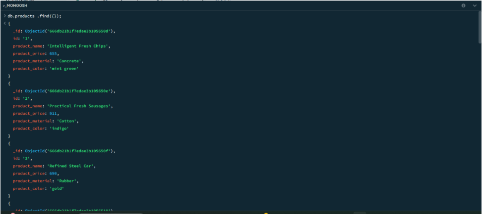
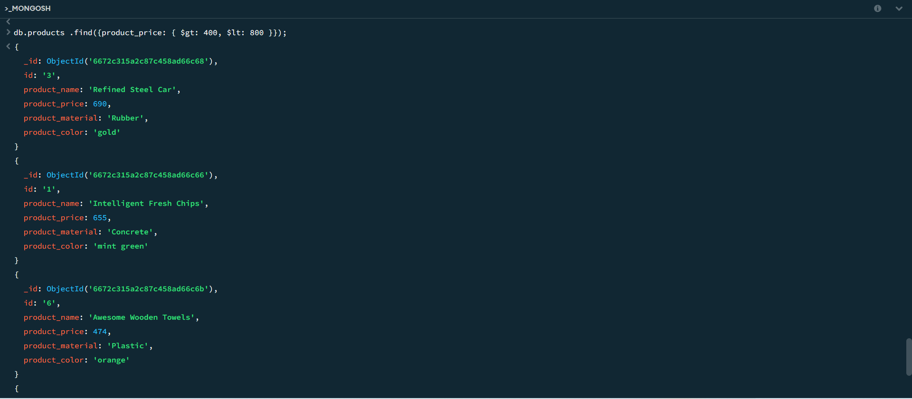
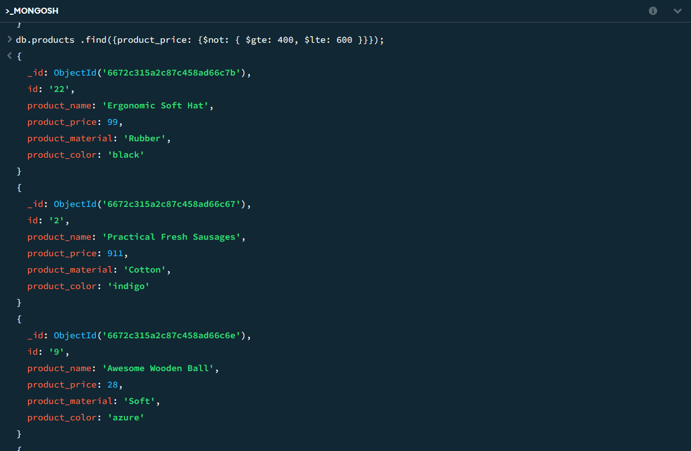
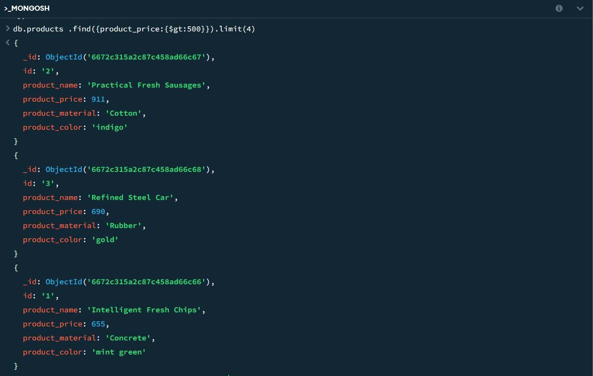
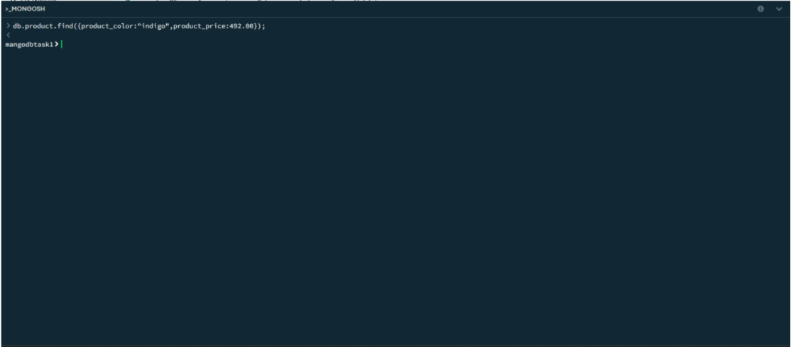

1. Find all the information about each products.     
 
- Query:

db.products .find({});

- Output:

2. Find the product price which are between 400 to 800.

- Query:

db.products .find({product_price: { $gt: 400, $lt: 800 }});

- Output:

3. Find the product price which are not between 400 to 600.

- Query:

db.products .find({product_price: {$not: { $gte: 400, $lte: 600 }}});

- Output:

4. List the four product which are greater than 500 in price.

- Query:

db.products .find({product_price:{$gt:500}}).limit(4)

- Output

5. Find the product name and product material of each products.

- Query:

db.products .find({},{ product_name: 1, product_material: 1 });

- Output

6.Find the product with a row id of 10.

- Query:

db.products .find({id: '10'});

- Output

7. Find only the product name and product material.

- Query:

db.products .find({},{ product_name: 1, prodduct_material: 1 });

- Output

8. Find all products which contain the value of soft in product material.

- Query:

db.products .find({product_material: 'Soft'});

-Output:

9. Find products which contain product color indigo and product price 492.00

- Query:

db.products.find({ [{ product_price: 492 },{ product_color: 'indigo' }]});

- Output:

10. Delete the products which product price value are 28.

- Query:

db.products.deleteOne({product_price:28});

- Output:

